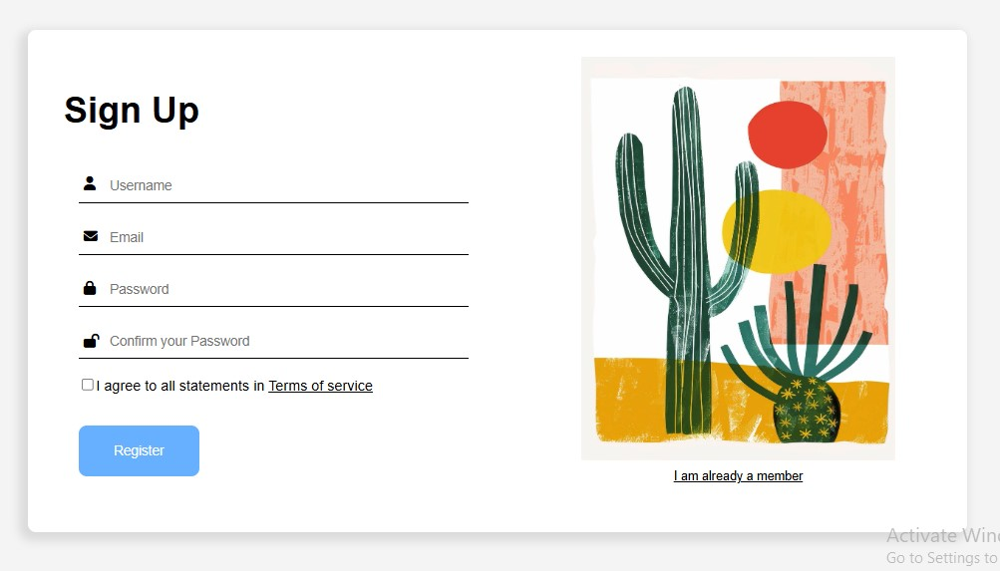
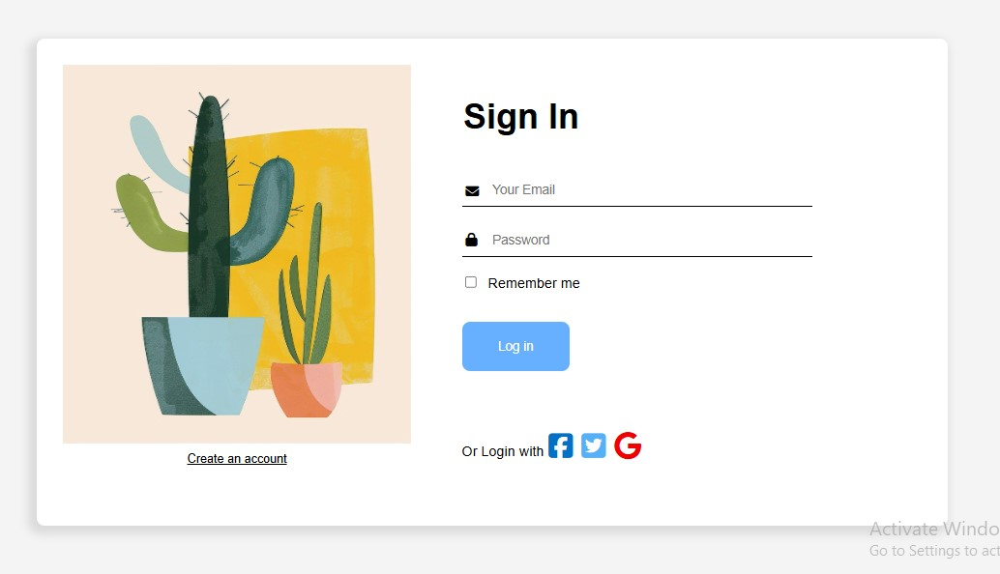
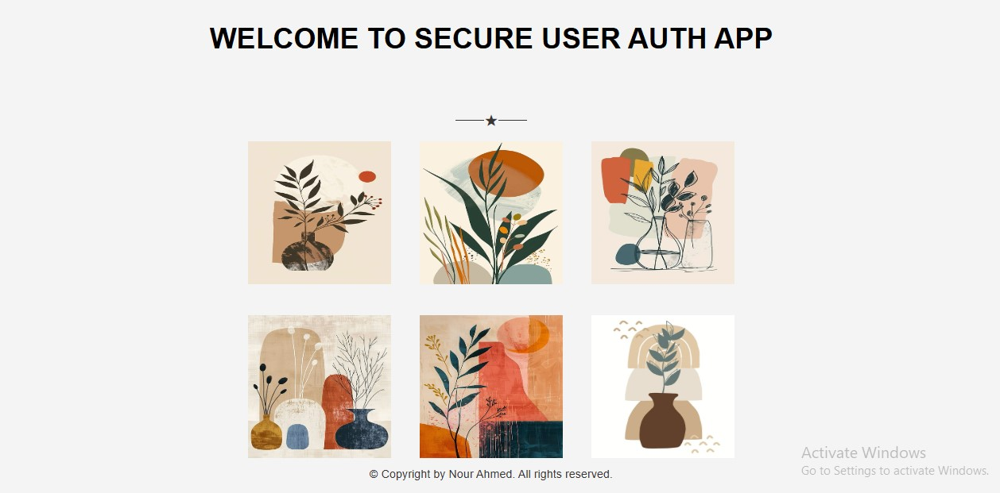

# Secure User Authentication System

A modern and secure authentication system built with Node.js, Express, and MongoDB, featuring a clean and responsive user interface.

## Overview

This project implements a complete authentication system with signup and signin functionality, featuring a modern UI design with animated alerts. The system is built using Node.js and Express on the backend, with Pug templating engine for the frontend views.

## Key Features

- 🔐 Secure user authentication
- 📝 User registration with email verification
- 🎨 Modern and responsive UI design
- 🚨 Animated alert notifications
- 💾 MongoDB database integration
- 🛡️ Protected routes and user sessions

## Demo

### Sign Up Page

### Sign In Page

### Home Page

## Technologies Used

- Node.js
- Express.js
- MongoDB
- Pug Template Engine
- CSS3
- JavaScript (ES6+)
- Font Awesome Icons

### Installation

1. Clone the repository
2. Install dependencies using `npm install`
3. Start the server using `npm start`
